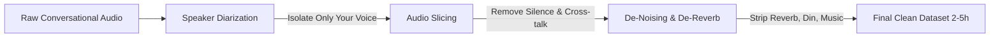

# Advanced Analysis: Scaling Voice Cloning to 20+ Hours of Conversational Data
> **Target Scenario**: 20+ hours of real-world recordings (meetings, dinners, casual chat), long training times, aiming for the absolute highest possible fidelity.

If you have **20+ hours of speech data** and are willing to train for a long time without worrying about training duration, the technical landscape shifts dramatically. 

---

## 1. Why RVC is NOT the Best Choice for 20+ Hours

While RVC (Retrieval-based Voice Conversion) is the king of quick training (10m - 2h), it scales poorly when fed massive datasets:

1. **Model Capacity Bottleneck**:
   RVC uses a relatively small neural network architecture (~60M parameters). When fed 20+ hours of data, the model quickly hits its "capacity ceiling." It cannot absorb the rich acoustic details of such a large dataset and will stop improving.
2. **FAISS Index Collision**:
   RVC relies on a similarity search database (`.index` file). A 20-hour dataset will generate a massive index file (several gigabytes). During conversion, this huge database leads to **vector collisions**—similar-sounding acoustic vectors mapping to different vocal situations. This causes metallic "glitches," robotic artifacts, or sudden changes in tone during speech.
3. **Over-generalization**:
   To make RVC work on massive data, you have to lower the index rate during conversion. Doing so causes the output to sound more "average" and lose the unique, subtle details of your voice.

---

## 2. Why So-VITS-SVC 4.1 Excels at Scale

For large datasets (10h - 50h+), **So-VITS-SVC 4.1 is the vastly superior choice**:

```
[20+ Hours Clean Audio] ──> [Generative VAE + Normalizing Flows] ──> [Mathematical Vocal Mapping (No Index Needed)]
```

* **No Index Database**: So-VITS-SVC does not use a vector lookup table. It maps the vocal transformation mathematically directly into the neural network's generative weights.
* **Deep Neural Capacity**: It uses a larger VITS-based generative model. A 20-hour dataset provides the network with enough statistical distribution to learn the true characteristics of your voice across different emotions, speeds, pitches, and volumes.
* **Flawless Transitions**: The output is smoother, richer, and maintains high fidelity even during complex vocal transitions (singing, whispering, laughing, shouting).
* **Perfect for Blackwell**: Training So-VITS-SVC on 20 hours will take 24–48 hours of continuous training. On our **NVIDIA Blackwell GB10 GPU** (with unified memory/ATS), we can maximize the batch size (e.g., `batch_size=128`) and train with 44.1kHz high-resolution audio, which will significantly speed up the convergence.

---

## 3. The Hidden Trap: Noise, Echo, and Cross-Talk

Using real-world conversational data (meetings, dinners, casual chat) introduces a critical problem: **Data Noise**.
In voice cloning, **quality is far more important than quantity**. If you train a model on raw recordings from restaurants or meeting rooms, the model will treat the environment as part of your voice. The cloned voice will permanently sound like it has room echo, background clank, or background noise.

To prevent this, we must build a **Surgical Preprocessing Pipeline** to clean the 20 hours of raw audio:



### The 3 Core Preprocessing Steps:
1. **Speaker Diarization (Speaker Separation)**:
   We must run a model (like `PyAnnote`) to identify when you are speaking versus when your friends, colleagues, or clients are speaking. We must discard all segments where other people are speaking.
2. **De-noising & De-reverb (Vocal Isolation)**:
   Real-life audios contain restaurant clatter, wind, typing, and room echo (reverb). We must run them through neural separation networks (like **Demucs v4** or **UVR**) to extract 100% dry, studio-quality vocals.
3. **Voice Activity Detection (VAD)**:
   Automatically split the long audio into 2-10 second clips and remove long silent gaps.

---

## 4. Final Verdict & Plan

For **20+ hours of raw conversational data**, the optimal stack is:
* **Model**: **So-VITS-SVC 4.1** (to absorb the data scale and maximize generative fidelity).
* **Environment**: **Docker container** running PyTorch `2.12.0+cu130` on Blackwell.
* **Preprocessing Pipeline**: A dedicated workspace folder `myvoiceclone/preprocess/` utilizing **Demucs** (for de-noising) and **PyAnnote** (for speaker diarization).

### The Action Plan:
1. **Phase 1: Setup the Cleaning Station**:
   We will write scripts in `myvoiceclone/preprocess/` to automate audio slicing, vocal extraction (de-noising/de-reverb), and speaker diarization.
2. **Phase 2: Extract the Clean Dataset**:
   You upload your raw 20-hour recordings. We run the cleaning pipeline, which will output a pristine, noise-free dataset of your voice (which might shrink to a highly concentrated 3-5 hours of pure speech).
3. **Phase 3: Train So-VITS-SVC 4.1**:
   Deploy the So-VITS-SVC Docker container and start a long-duration training run on the Blackwell GPU.
